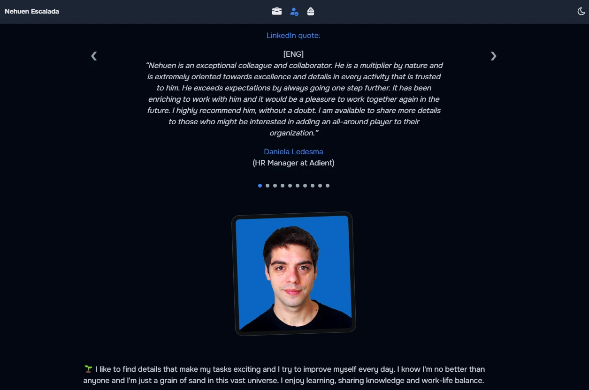
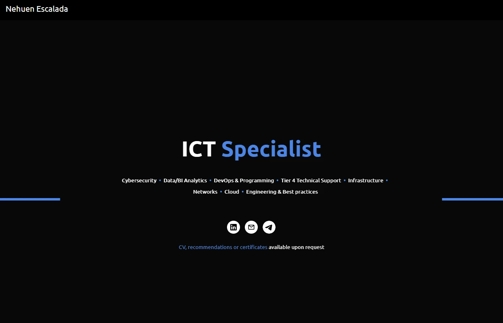

# 👨🏻‍💻 Porfolio nescalada (mix google sites y midudev)

Some month ago I made a simple Google Sites portfolio but as I know I need to show a little of my dev skills I decided to make a new portfolio. So I made it inspired in my previous Google Sites and Midudev portfolio with Astro, Tailwind CSS and more.

Feel free to use this portfolio as template for your own projects 🚀.

